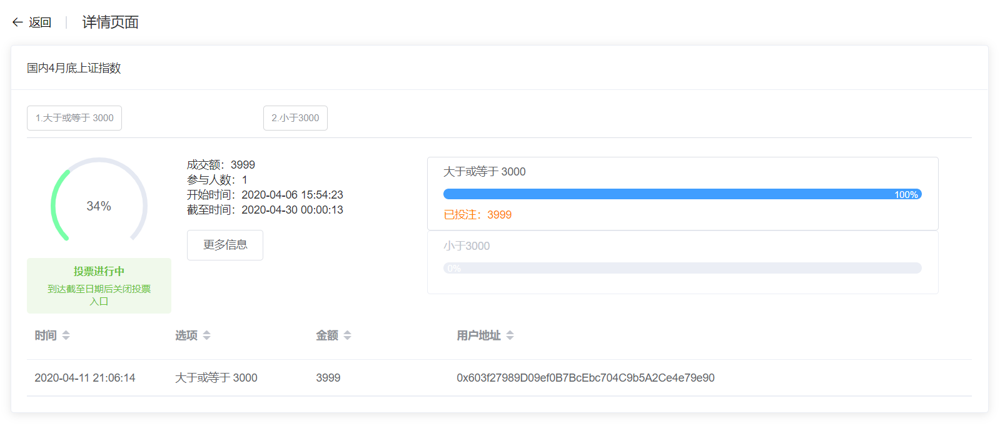
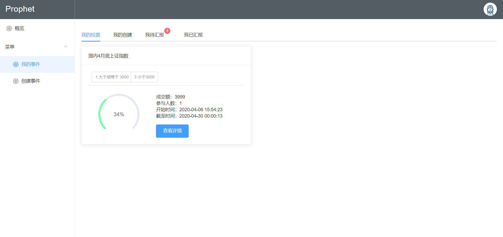
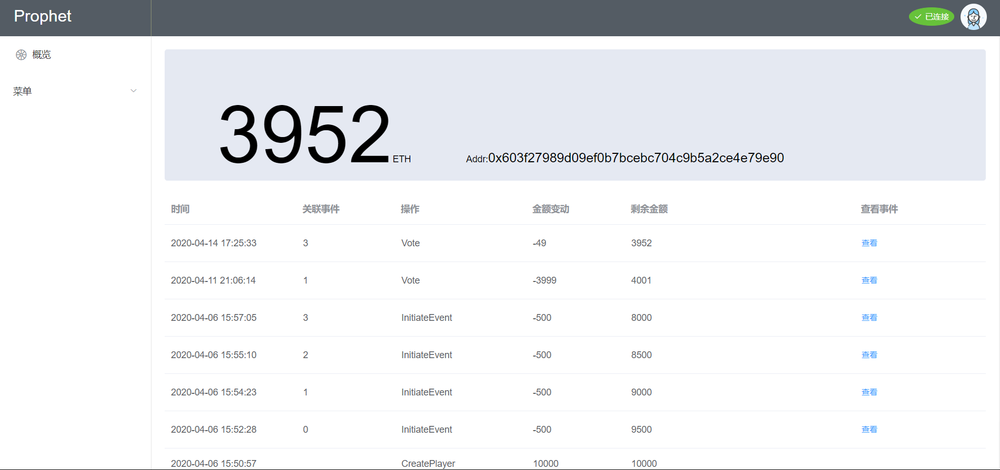
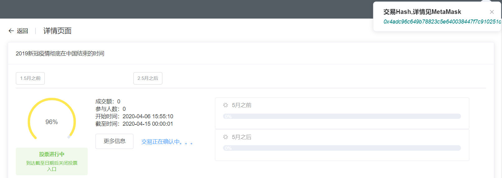

# Prophet（预言家）
[中文](README.md) | [English](README.en.md)
## Voting prediction platform based on Ethereum blockchain smart contract technology and Vue framework
- ## [The project has been deployed, online Demo](https://t940783074.gitee.io/prophet)
Due to international network restrictions, it is not possible to directly use [Infura](https://infura.io/) to access the Ethereum Dapp, so the complete experience of the platform uses the solution of installing the [MetaMask](https://metamask.io/) browser plug-in.
## Function and optimization
- [x] Connect blockchain
- [x] Create user
- [x] Personal information display
- [x] Voting event display
- [x] Create event
- [x] Event voting
- [x] Event reporting
- [x] Apply for rewards
- [x] Different colors show event status
- [x] Show user all operation records
- [x] Other

## Technology used
- VueCli
- Vue 2.x
- Vuex
- Vue Router
- [Element UI](http://element.eleme.io/#/zh-CN)
- [Web3.js](https://github.com/ethereum/web3.js/)
- ES6
- Node.js
- axios
- webpack
- Other

## Brief introduction of the project
- Classified display events
- Progress bars and colors represent events for different durations of validity
- Provide view details button

- Display event status, current voting information and all user voting records, etc.

- Classified display events
- Report event icon reminder

- form validation
- Quick date selection

- Create user
- Blockchain information display

- Eye-catching personal platform token balance
- Personal operation record

- Some small details（[Browse the demo to find out more](https://t940783074.gitee.io/prophet)）



## Project setup
```
npm install
```

## Compiles and hot-reloads for development
```
npm run serve
```

## Compiles and minifies for production
```
npm run build
```

## Customize configuration
See [Configuration Reference](https://cli.vuejs.org/config/).

## Open source agreement
- Please follow the original author MIT open source agreement
