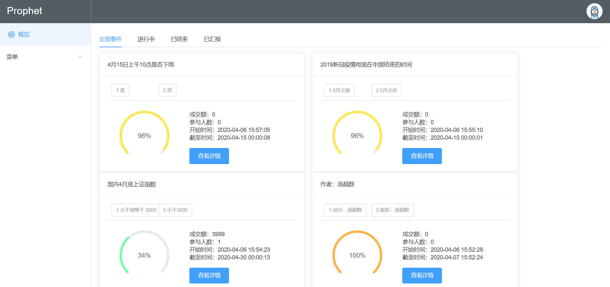
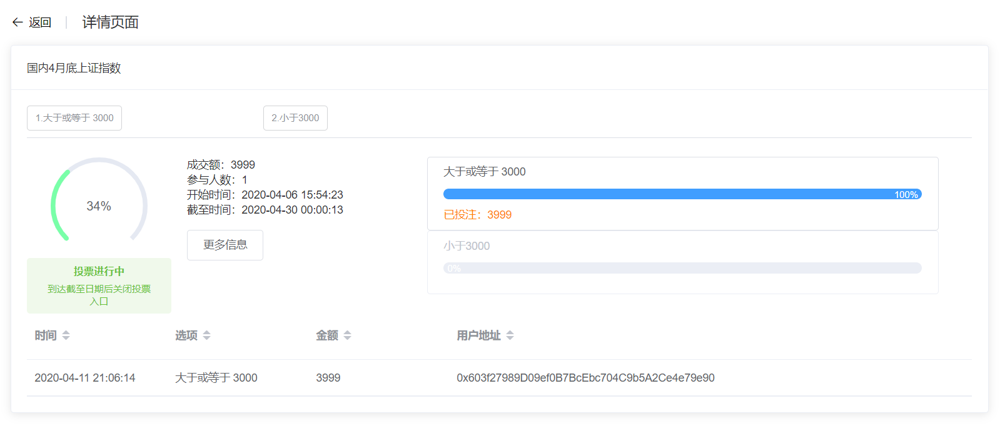
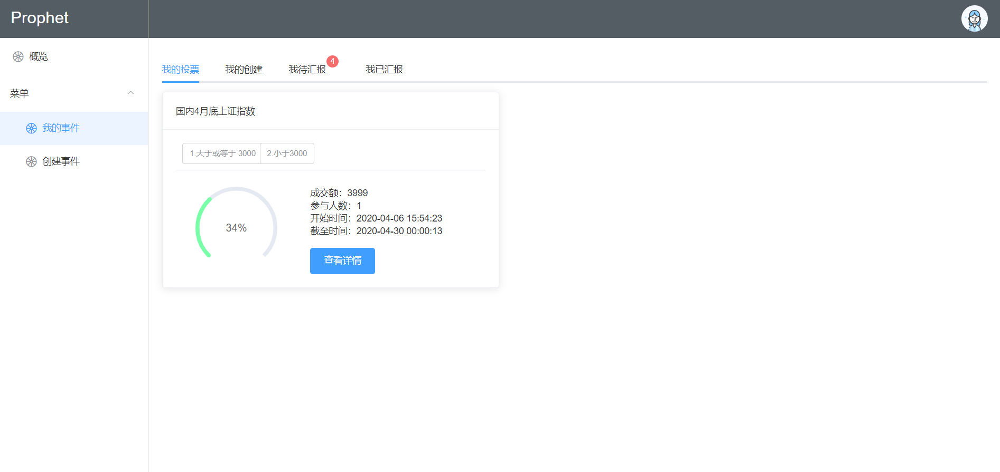
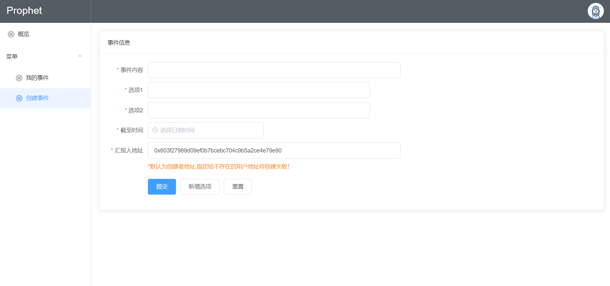
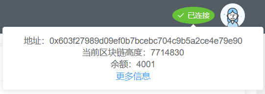
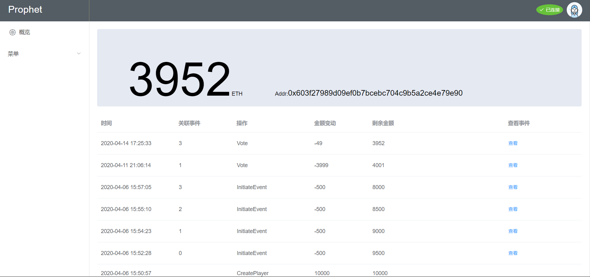
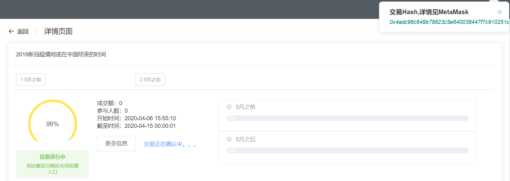
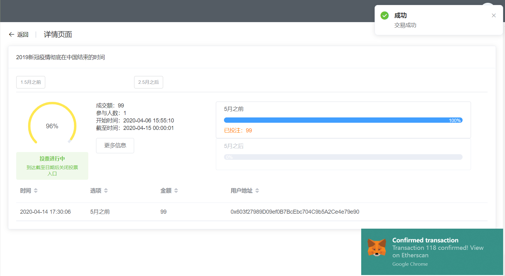

# Prophet（预言家）
[中文](README.md) | [English](README.en.md)
## 基于以太坊区块链智能合约技术和Vue框架开发的投票预测平台
- ## [项目已部署，在线Demo](https://t940783074.gitee.io/prophet)
介于国际网络限制，无法直接使用[Infura](https://infura.io/)访问以太坊Dapp，因此平台完整体验采用安装[MetaMask](https://metamask.io/)浏览器插件的解决办法。
## 功能与优化
- [x] 连接区块链
- [x] 创建用户
- [x] 个人信息展示
- [x] 投票事件展示
- [x] 创建事件
- [x] 事件投票
- [x] 事件汇报
- [x] 申请奖励
- [x] 不同颜色展示事件状态
- [x] 展示用户所以操作记录
- [x] Other

## 所用技术
- VueCli
- Vue 2.x
- Vuex
- Vue Router
- [Element UI](http://element.eleme.io/#/zh-CN)
- [Web3.js](https://github.com/ethereum/web3.js/)
- ES6
- Node.js
- axios
- webpack
- 其他

## 项目简略介绍
- 分类展示事件
- 进度条和颜色表示不同有效期时长的事件
- 提供查看详情按钮

- 展示事件状态、当前投票信息和所有用户投票纪录等

- 分类展示事件
- 汇报事件图标提醒

- 表单验证
- 快捷日期选择

- 创建用户
- 区块链信息展示

- 醒目的个人平台代币余额
- 个人操作纪录

- 部分小细节（[浏览demo发现更多](https://t940783074.gitee.io/prophet)）




## Project setup
```
npm install
```

## Compiles and hot-reloads for development
```
npm run serve
```

## Compiles and minifies for production
```
npm run build
```

## Customize configuration
See [Configuration Reference](https://cli.vuejs.org/config/).

## 开源协议
- 请遵循原作者MIT开源协议
